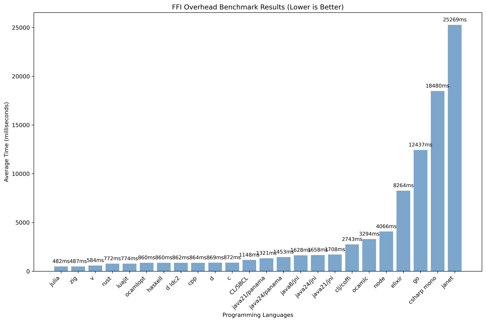

ffi-overhead
============

comparing the c ffi overhead on various programming languages

# Results (2025-08)

> [!WARNING]  
> Disclaimer: I have no idea what I am doing. Do not believe this.

The benchmark results can be visualized using the automated benchmarking harness:



*Chart shows average execution times across multiple runs. Lower values are better.*

Raw data: [data/2025-08/raw_data.csv](./data/2025-08/data.csv)

Tool chain versions used: [data/2025-08/toolchain.txt](./data/2025-08/toolchain.txt)

The native function is, ran `count` times

``` c
int plusone(int x)
{
    return x + 1;
}
```

```
❯ ./bench.py --verbose --csv data/2025-08/data.csv --chart ./data/2025-08/chart.png --baseline c
Benchmark Results (2 runs, count=500,000,000)
───────────────────────────────────────────────────────────────────────────────
│ Benchmark     │     Mean │      Min │      Max │  Std Dev │     vs Baseline │
───────────────────────────────────────────────────────────────────────────────
│ julia         │   482 ms │   478 ms │   485 ms │   4.9 ms │    1.81x faster │
│ zig           │   487 ms │   483 ms │   491 ms │   5.7 ms │    1.79x faster │
│ v             │   584 ms │   581 ms │   587 ms │   4.2 ms │    1.49x faster │
│ rust          │   772 ms │   770 ms │   773 ms │   2.1 ms │    1.13x faster │
│ luajit        │   774 ms │   768 ms │   780 ms │   8.5 ms │    1.13x faster │
│ d             │   869 ms │   864 ms │   874 ms │   7.1 ms │    1.00x faster │
│ ocamlopt      │   860 ms │   851 ms │   868 ms │  12.0 ms │    1.02x faster │
│ cpp           │   864 ms │   864 ms │   865 ms │   0.7 ms │    1.01x faster │
│ d ldc2        │   862 ms │   861 ms │   862 ms │   0.7 ms │    1.01x faster │
│ haskell       │   860 ms │   857 ms │   863 ms │   4.2 ms │    1.01x faster │
│ c             │   872 ms │   870 ms │   875 ms │   3.5 ms │ 1.00x (baseline)│
│ CL/SBCL       │  1148 ms │  1138 ms │  1159 ms │  14.8 ms │    1.32x slower │
│ java21/panama │  1321 ms │  1318 ms │  1324 ms │   4.2 ms │    1.51x slower │
│ java24/panama │  1453 ms │  1442 ms │  1464 ms │  15.6 ms │    1.67x slower │
│ java8/jni     │  1628 ms │  1439 ms │  1818 ms │ 268.0 ms │    1.87x slower │
│ java21/jni    │  1708 ms │  1674 ms │  1742 ms │  48.1 ms │    1.96x slower │
│ java24/jni    │  1658 ms │  1654 ms │  1663 ms │   6.4 ms │    1.90x slower │
│ clj/coffi     │  2743 ms │  2660 ms │  2826 ms │ 117.4 ms │    3.14x slower │
│ ocamlc        │  3294 ms │  2684 ms │  3904 ms │ 862.7 ms │    3.78x slower │
│ node          │  4066 ms │  4039 ms │  4093 ms │  38.2 ms │    4.66x slower │
│ elixir        │  8264 ms │  8193 ms │  8335 ms │ 100.4 ms │    9.47x slower │
│ go            │ 12437 ms │ 12206 ms │ 12668 ms │ 326.7 ms │   14.25x slower │
│ csharp mono   │ 18480 ms │ 18391 ms │ 18569 ms │ 125.9 ms │   21.18x slower │
│ janet         │ 25269 ms │ 24542 ms │ 25996 ms │ 1028.1 ms│   28.96x slower │
───────────────────────────────────────────────────────────────────────────────
```

Ran on a AMD Ryzen 9 7950X3D 16-Core cpu

I disabled dart, wren, and nim because I couldn't get them working after
banging on it for about an hour, and (sorry not sorry) I don't care so much to
fix them.


# Usage

Requirements:

 - nix w/ flakes enabled

This project includes a Nix flake for reproducible development environments.

## Usage
```sh
# Enter the development shell
nix develop

# Or run commands directly in the development shell
nix develop --command -- ./compile-all.sh
nix develop --command -- ./run-all.sh 500000000
```

The Nix environment includes all required compilers, runtimes, and build tools, including multiple Java versions (8, 21, 24) in the `vendor/` directory.

Current environment (Nix) (2025-08):
```
- x86_64 Linux 6.12.41
- gcc/g++ 14.3.0
- tup 0.8
- zig 0.14.1
- v V 0.4.11
- java8 1.8.0_462
- java21 21.0.7
- java24 24.0.2
- go 1.24.5
- rust 1.88.0 (6b00bc388 2025-06-23) (built from a source tarball)
- dmd D
- ldc2 compiler
- ghc 9.8.4
- ocaml 5.3.0
- mono 6.14.1
- sbcl 2.5.5
# dynamic languages
- luajit 2.1.1741730670
- julia 1.11.6
- node 22.17.0
- elixir 1.18.4 (Erlang/OTP 27)
- janet 1.38.0-release
- clojure 1.12.1 (coffi 1.0.615)
- nim 2.2.4 (disabled - rpath issues)
- dart 3.8.2 (disabled - deprecated native extensions)
- wren not available (not in nixpkgs)
```

### Run

```sh
# Run with defaults (2 runs, 500M calls)
nix develop --command -- python3 bench.py --verbose

# Custom parameters
nix develop --command -- python3 bench.py --verbose --runs 5 --count 1000000

# Specify output files
nix develop --command -- python3 bench.py --verbose --csv my_results.csv --chart my_chart.png
```
