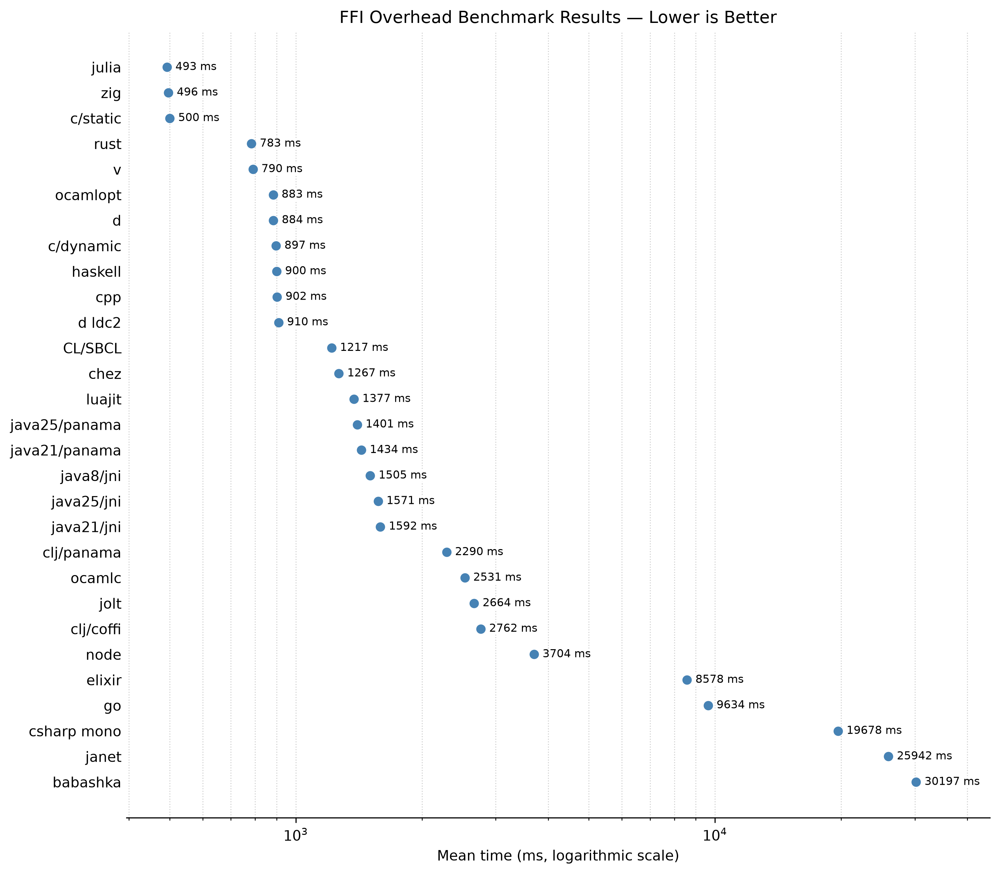

ffi-overhead
============

comparing the c ffi overhead on various programming languages

# Results (2026-08)

> [!WARNING]
> I have no idea what I am doing. Do not believe this.



*Chart shows average execution times across 10 runs on a logarithmic scale. Lower values are better.*

Raw data: [data/2026-08/data.csv](./data/2026-08/data.csv)

Toolchain versions and build provenance: [data/2026-08/toolchain.txt](./data/2026-08/toolchain.txt)

Previous results: [2025-08 data](./data/2025-08/data.csv), [chart](./data/2025-08/chart.png), and [toolchain](./data/2025-08/toolchain.txt).

Each implementation calls this native function `count` times:

```c
int plusone(int x)
{
    return x + 1;
}
```

```sh
nix develop --command -- python3 bench.py \
  --verbose \
  --csv data/2026-08/data.csv \
  --chart data/2026-08/chart.png \
  --baseline c/static \
  --runs 10 \
  --count 500000000
```

| Benchmark | Mean | Min | Max | Std dev | vs baseline |
|---|---:|---:|---:|---:|---:|
| c/static | 500 ms | 491 ms | 506 ms | 4.9 ms | 1.00x (baseline) |
| luajit | 1377 ms | 1368 ms | 1384 ms | 4.8 ms | 2.75x slower |
| c/dynamic | 897 ms | 881 ms | 909 ms | 7.2 ms | 1.79x slower |
| cpp | 902 ms | 893 ms | 920 ms | 8.8 ms | 1.80x slower |
| CL/SBCL | 1217 ms | 1194 ms | 1285 ms | 26.1 ms | 2.43x slower |
| chez | 1267 ms | 1204 ms | 1605 ms | 123.1 ms | 2.53x slower |
| zig | 496 ms | 494 ms | 499 ms | 1.4 ms | 1.01x faster |
| v | 790 ms | 778 ms | 797 ms | 5.9 ms | 1.58x slower |
| rust | 783 ms | 777 ms | 794 ms | 4.8 ms | 1.57x slower |
| d | 884 ms | 872 ms | 912 ms | 15.1 ms | 1.77x slower |
| d ldc2 | 910 ms | 875 ms | 979 ms | 30.4 ms | 1.82x slower |
| haskell | 900 ms | 883 ms | 934 ms | 15.0 ms | 1.80x slower |
| ocamlopt | 883 ms | 880 ms | 886 ms | 2.2 ms | 1.76x slower |
| ocamlc | 2531 ms | 2437 ms | 3158 ms | 221.2 ms | 5.06x slower |
| csharp mono | 19678 ms | 19502 ms | 20027 ms | 185.3 ms | 39.32x slower |
| java8/jni | 1505 ms | 1460 ms | 1672 ms | 66.5 ms | 3.01x slower |
| java21/jni | 1592 ms | 1535 ms | 1684 ms | 40.9 ms | 3.18x slower |
| java25/jni | 1571 ms | 1536 ms | 1637 ms | 32.7 ms | 3.14x slower |
| java21/panama | 1434 ms | 1411 ms | 1450 ms | 15.2 ms | 2.87x slower |
| java25/panama | 1401 ms | 1378 ms | 1463 ms | 24.6 ms | 2.80x slower |
| node | 3704 ms | 3623 ms | 3767 ms | 48.5 ms | 7.40x slower |
| go | 9634 ms | 9401 ms | 9868 ms | 161.1 ms | 19.25x slower |
| elixir | 8578 ms | 8451 ms | 8840 ms | 108.9 ms | 17.14x slower |
| julia | 493 ms | 481 ms | 504 ms | 8.7 ms | 1.02x faster |
| janet | 25942 ms | 25720 ms | 26313 ms | 232.9 ms | 51.84x slower |
| jolt | 2664 ms | 2599 ms | 2760 ms | 53.7 ms | 5.32x slower |
| babashka | 30197 ms | 30056 ms | 30907 ms | 262.1 ms | 60.35x slower |
| clj/panama | 2290 ms | 2154 ms | 2525 ms | 108.2 ms | 4.58x slower |
| clj/coffi | 2762 ms | 2628 ms | 2877 ms | 81.0 ms | 5.52x slower |

Ran on an AMD Ryzen 9 7950X3D 16-Core CPU.

Babashka's fixed `[:int] -> :int` binding uses its compiled `:trampoline` backend. The binary was built from upstream Git with Java FFM support and linked libffi 3.8.0 fallback support.

Dart, Wren, and Nim remain excluded from the published benchmark population.

# Usage

Requirements:

 - nix w/ flakes enabled

This project includes a Nix flake for reproducible development environments.

## Usage
```sh
# Enter the development shell
nix develop

# Or run commands directly in the development shell
nix develop --command -- ./compile-all.sh
nix develop --command -- ./run-all.sh 500000000
```

The Nix environment includes all required compilers, runtimes, and build tools, including Java versions 8, 21, and 25 in the `vendor/` directory and the flake-built Babashka.

Current environment (Nix) (2026-08):
```text
- x86_64 Linux 6.18.39
- CPU AMD Ryzen 9 7950X3D 16-Core Processor
- gcc/g++ 15.3.0
- tup 0.8
- python 3.14.7 (matplotlib 3.11.1, numpy 2.5.1)
- zig 0.16.0
- v V 0.5.2
- java8 1.8.0_504
- java21 21.0.12
- java25 25.0.4
- go 1.26.5
- rust 1.97.1
- dmd 2.112.1
- ldc2 1.42.0
- ghc 9.10.3
- chez 10.4.1
- ocaml 5.4.1
- mono 6.14.1
- sbcl 2.6.7
# dynamic languages
- luajit 2.1.1774638290
- julia 1.12.7
- node 24.19.0
- elixir 1.18.4 (Erlang/OTP 28)
- janet 1.41.2-release
- jolt aafa0fc
- clojure 1.12.5 (coffi 1.0.615)
- babashka 1.13.220-SNAPSHOT (libffi 3.8.0, plusone backend trampoline)
- nim 2.2.10 (disabled - rpath issues)
- dart 3.13.0 (disabled - deprecated native extensions)
- wren not available (not in nixpkgs)
```

### Run

```sh
# Run with defaults (2 runs, 500M calls)
nix develop --command -- python3 bench.py --verbose

# Custom parameters
nix develop --command -- python3 bench.py --verbose --runs 5 --count 1000000

# Specify output files
nix develop --command -- python3 bench.py --verbose --csv my_results.csv --chart my_chart.png
```

### Update one published benchmark

Use `--include` with `--update` to replace one benchmark in an existing dataset
without rerunning the full suite. Other CSV rows are preserved, and the chart is
regenerated from the merged data.

```sh
nix develop --command -- python3 bench.py \
  --verbose \
  --include zig \
  --runs 10 \
  --count 500000000 \
  --csv data/2026-08/data.csv \
  --chart data/2026-08/chart.png \
  --update
```

`--update` requires an existing `--csv` file so it cannot accidentally publish a
partial dataset.
