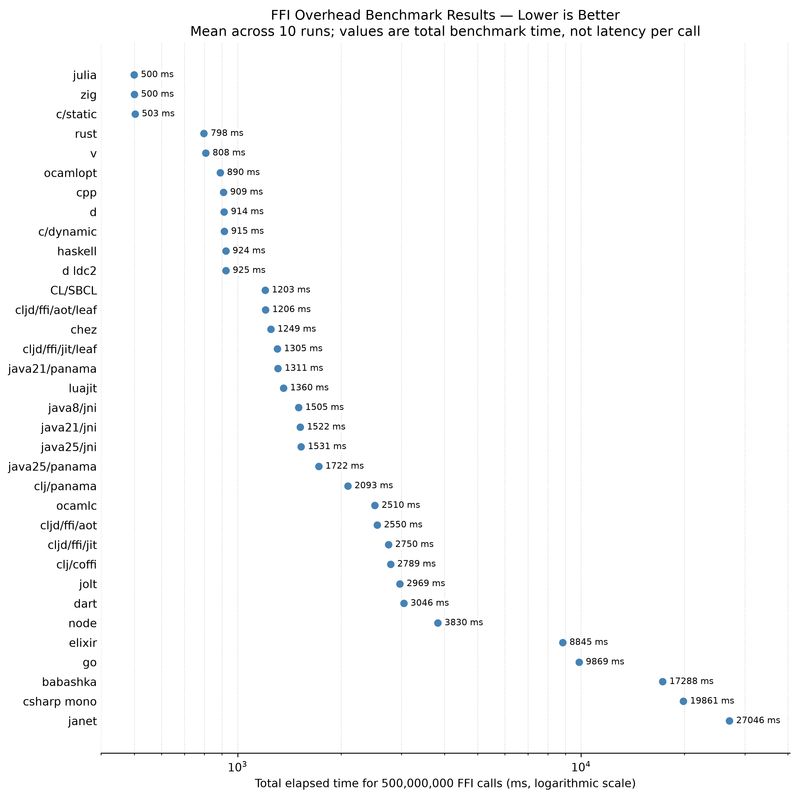

ffi-overhead
============

comparing the c ffi overhead on various programming languages

# Results (2026-09-08)

> [!WARNING]
> I have no idea what I am doing. Do not believe this.



*Chart shows average execution times across 10 runs on a logarithmic scale. Lower values are better.*

*CV is sample standard deviation divided by mean. Absolute timings remain in the raw CSV.*

| Benchmark | Mean | Min | Max | CV | vs baseline |
|---|---:|---:|---:|---:|---:|
| c/static | 503 ms | 498 ms | 512 ms | 0.7% | 1.00x (baseline) |
| julia | 500 ms | 495 ms | 506 ms | 0.6% | 1.01x faster |
| zig | 500 ms | 494 ms | 508 ms | 0.9% | 1.00x faster |
| rust | 798 ms | 789 ms | 809 ms | 0.8% | 1.59x slower |
| v | 808 ms | 801 ms | 817 ms | 0.6% | 1.61x slower |
| ocamlopt | 890 ms | 876 ms | 898 ms | 0.8% | 1.77x slower |
| cpp | 909 ms | 874 ms | 987 ms | 4.5% | 1.81x slower |
| d | 914 ms | 906 ms | 923 ms | 0.7% | 1.82x slower |
| c/dynamic | 915 ms | 877 ms | 992 ms | 4.1% | 1.82x slower |
| haskell | 924 ms | 895 ms | 957 ms | 2.8% | 1.84x slower |
| d ldc2 | 925 ms | 896 ms | 966 ms | 2.6% | 1.84x slower |
| CL/SBCL | 1203 ms | 1169 ms | 1267 ms | 2.8% | 2.39x slower |
| cljd/ffi/aot/leaf | 1206 ms | 1188 ms | 1223 ms | 0.9% | 2.40x slower |
| chez | 1249 ms | 1217 ms | 1313 ms | 2.7% | 2.48x slower |
| cljd/ffi/jit/leaf | 1305 ms | 1292 ms | 1337 ms | 1.1% | 2.60x slower |
| java21/panama | 1311 ms | 1187 ms | 1417 ms | 6.3% | 2.61x slower |
| luajit | 1360 ms | 1340 ms | 1377 ms | 1.1% | 2.70x slower |
| java8/jni | 1505 ms | 1480 ms | 1540 ms | 1.3% | 2.99x slower |
| java21/jni | 1522 ms | 1469 ms | 1595 ms | 2.8% | 3.03x slower |
| java25/jni | 1531 ms | 1500 ms | 1550 ms | 1.1% | 3.04x slower |
| java25/panama | 1722 ms | 1335 ms | 4454 ms | 56.6% | 3.43x slower |
| clj/panama | 2093 ms | 2045 ms | 2193 ms | 2.5% | 4.16x slower |
| ocamlc | 2510 ms | 2467 ms | 2592 ms | 1.5% | 4.99x slower |
| cljd/ffi/aot | 2550 ms | 2521 ms | 2614 ms | 1.2% | 5.07x slower |
| cljd/ffi/jit | 2750 ms | 2665 ms | 2909 ms | 3.1% | 5.47x slower |
| clj/coffi | 2789 ms | 2690 ms | 2860 ms | 1.8% | 5.55x slower |
| jolt | 2969 ms | 2752 ms | 3452 ms | 7.9% | 5.90x slower |
| dart | 3046 ms | 2996 ms | 3152 ms | 1.7% | 6.06x slower |
| node | 3830 ms | 3754 ms | 3962 ms | 1.6% | 7.62x slower |
| elixir | 8845 ms | 8756 ms | 8985 ms | 0.8% | 17.59x slower |
| go | 9869 ms | 9584 ms | 10048 ms | 1.4% | 19.63x slower |
| babashka | 17288 ms | 16683 ms | 17980 ms | 2.7% | 34.38x slower |
| csharp mono | 19861 ms | 19548 ms | 20105 ms | 1.0% | 39.50x slower |
| janet | 27046 ms | 26433 ms | 27754 ms | 1.3% | 53.79x slower |

All 34 configured benchmarks ran on an AMD Ryzen 9 7950X3D.

Raw data: [data/2026-09-08/data.csv](./data/2026-09-08/data.csv)

Toolchain versions and build provenance: [data/2026-09-08/toolchain.txt](./data/2026-09-08/toolchain.txt)

Previous results: [2026-08 data](data/2026-08/data.csv), [chart](data/2026-08/chart.png), and [toolchain](data/2026-08/toolchain.txt).

Previous results: [2025-08 data](./data/2025-08/data.csv), [chart](./data/2025-08/chart.png), and [toolchain](./data/2025-08/toolchain.txt).

Each implementation calls this native function `count` times:

```c
int plusone(int x)
{
    return x + 1;
}
```

```sh
nix develop --command -- python3 bench.py \
  --verbose \
  --csv data/2026-09-08/data.csv \
  --readme README.md \
  --chart data/2026-09-08/chart.png \
  --toolchain data/2026-09-08/toolchain.txt \
  --baseline c/static \
  --runs 10 \
  --count 500000000
```

Wren and Nim remain excluded due to toolchain/skill issues on my part.

# Usage

Requirements:

 - nix w/ flakes enabled

This project includes a Nix flake for reproducible development environments.

## Usage
```sh
# Enter the development shell
nix develop

# Or run commands directly in the development shell
nix develop --command -- ./compile-all.sh
nix develop --command -- ./run-all.sh 500000000
```

The Nix environment includes all required compilers, runtimes, and build tools, including Java versions 8, 21, and 25 in the `vendor/` directory and the flake-built Babashka.

Current environment (Nix) (2026-09-08):
```text
- x86_64 Linux 6.18.45
- CPU AMD Ryzen 9 7950X3D 16-Core Processor
# flake inputs
- nixpkgs git 56c02bc00adcf003215cc4bd996d6efaf4cff188
- flakelight git 4d9eabe93ff4d73cc195a0e8dec0f3fbac31c226
- babashka-src tag v1.13.220 (git b98575c98a0ef4df77775ff25fd7fc7b591b1afd)
- jolt git e8b018cc162cb61c4573f17213cb329c416bd42d
- gcc/g++ 15.3.0
- tup 0.8
- python 3.14.7 (matplotlib 3.11.1, numpy 2.5.1)
- zig 0.16.0
- nim 2.2.10 (disabled - rpath issues)
- v V 0.5.2
- java8 1.8.0_504
- java21 21.0.12
- java25 25.0.4
- go 1.26.5
- rust 1.97.1 (8bab26f4f 2026-07-14) (built from a source tarball)
- dmd 2.112.1
- ldc2 1.42.0
- ghc 9.10.3
- chez 10.4.1
- ocaml 5.4.1
- mono 6.14.1
- sbcl 2.6.7
# dynamic languages
- luajit 2.1.1774638290
- julia 1.12.7
- node 24.19.0
- dart 3.13.0
- clojuredart 0.9.20260822a (Dart JIT/AOT)
- wren not available (not in nixpkgs)
- elixir 1.18.4 (Erlang/OTP 28)
- janet 1.41.2-release
- jolt git e8b018c
- clojure 1.12.5 (coffi 1.0.615)
- babashka 1.13.220 (git b98575c98a0ef4df77775ff25fd7fc7b591b1afd, libffi 3.8.0, plusone backend trampoline)
```

### Run

```sh
# Run with defaults (2 runs, 500M calls)
nix develop --command -- python3 bench.py --verbose

# Custom parameters
nix develop --command -- python3 bench.py --verbose --runs 5 --count 1000000

# Specify output files
nix develop --command -- python3 bench.py --verbose --csv my_results.csv --readme README.md --chart my_chart.png --toolchain my_toolchain.txt --baseline c/static
```

`--toolchain` regenerates the environment report with available tool versions and
flake-input Git revisions after a successful benchmark run.

`--readme` regenerates the results table from the complete result set and reports
variability as CV (sample standard deviation divided by mean).

### Update one published benchmark

Use `--include` with `--update` to replace one benchmark in an existing dataset
without rerunning the full suite. Other CSV rows are preserved, and the chart is
regenerated from the merged data.

```sh
nix develop --command -- python3 bench.py \
  --verbose \
  --include zig \
  --runs 10 \
  --count 500000000 \
  --csv data/2026-09-08/data.csv \
  --readme README.md \
  --chart data/2026-09-08/chart.png \
  --toolchain data/2026-09-08/toolchain.txt \
  --baseline c/static \
  --update
```

`--update` requires an existing `--csv` file so it cannot accidentally publish a
partial dataset.
